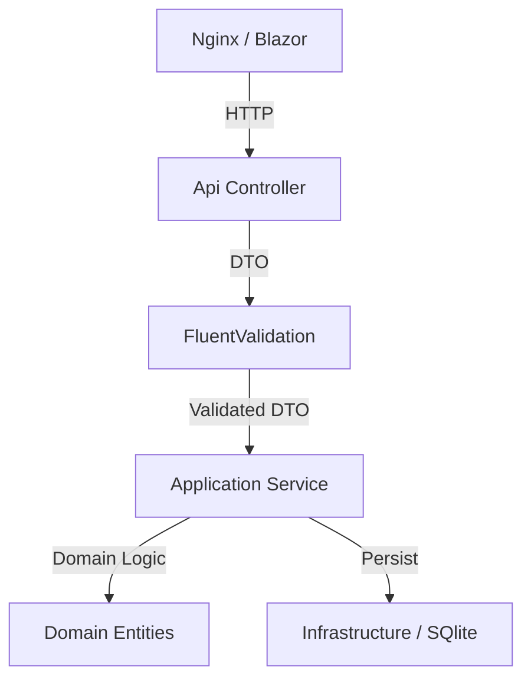

# Arquitetura do Sistema

O projeto adota os princípios da **Clean Architecture** e é construído inteiramente sobre o ecossistema **.NET 10**.

## Camadas do Backend (.NET 10)

### 1. Domain
- **Entidades**: `Order`, `OrderItem`, `MenuItem`. Centralizam a lógica de cálculo de totais e descontos.
- **Enums**: `OrderStatus`, `ItemType`.

### 2. Application
- **Services**: `OrderService` e `MenuService`.
- **Validators**: Implementação do **FluentValidation** para garantir a integridade dos dados de entrada.
- **DTOs**: Contratos de dados imutáveis (Records).

### 3. Infrastructure
- **Persistence**: EF Core com SQLite.
- **Repositories**: Acesso a dados desacoplado via interfaces.
- **Infra as Code**: Dockerfiles e Docker Compose localizados na pasta `/infra`.

### 4. Api
- **Controllers**: Endpoints RESTful.
- **Scalar**: Visualização premium da documentação OpenAPI.

## Frontend (Blazor WebAssembly)
- **MudBlazor**: Framework de UI premium.
- **SearchService**: Estado compartilhado para busca reativa e inteligente (ID vs Nome).

## Diagrama de Fluxo Técnico

